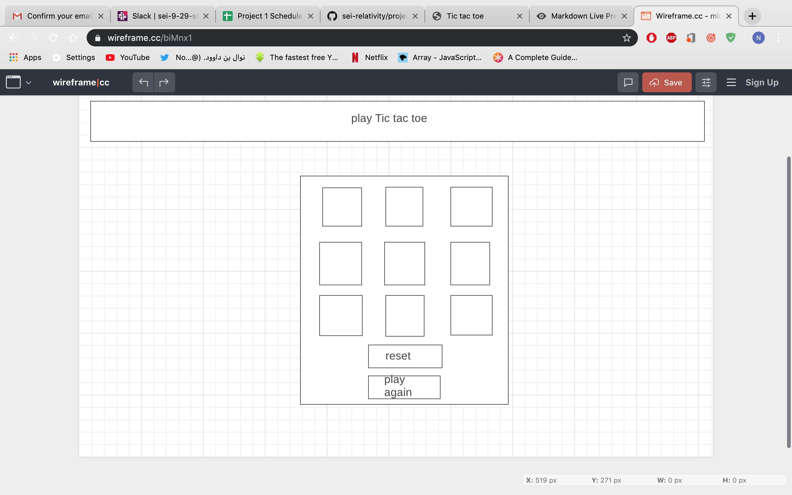

# hello this is my project..

----
## What's the project ?
> It's Tic tac toe, this is a simple game that i created with HTML, CSS and JavaScript

## Demo:

[Tic Tac Toe](http://127.0.0.1:5501/proj.html)

## Technology:
HTML
CSS
java script 
GIT
visualcode 

## approcah :

## screenshot

## Tic Tac Toe Features:
** Keep track of multiple game rounds with a win, lose and tie counter
** page refresh or loss of internet connectivity
** Involve Audio in your game

## How to play?
> Your goal is to win the big tic-tac-toe board by getting three in a row - either across, down, or diagonally - or getting a majority of the squares in a full grid. In order to earn one of the nine squares in the big board, you must win the smaller tic-tac-toe board contained within it.

> if you want to try it and see my game this is the link

## further improment :

** Create an AI opponent: teach JavaScript to play an unbeatable game against you
**  site fully responsive so that it is playable from a mobile phone
Get inventive with your styling e.g. use hover effects or animations
** Allow 2 players to play online with each other using any means such as WebSockets, Firebase, or other 3rd-party services.

-----
## Feedback and issues:
> I really appreciate your feedback. I'll be really grateful if you can drop me an email to Nawaldee21@gmail.com 

